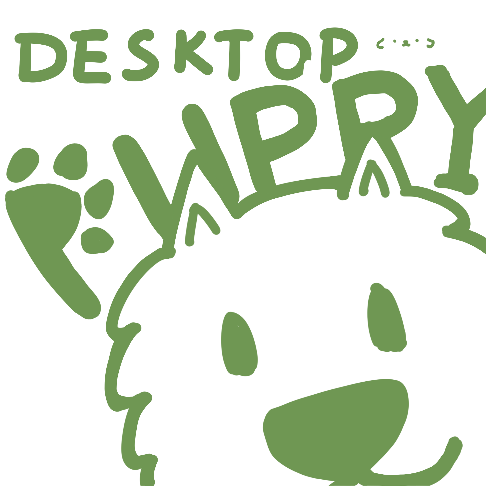
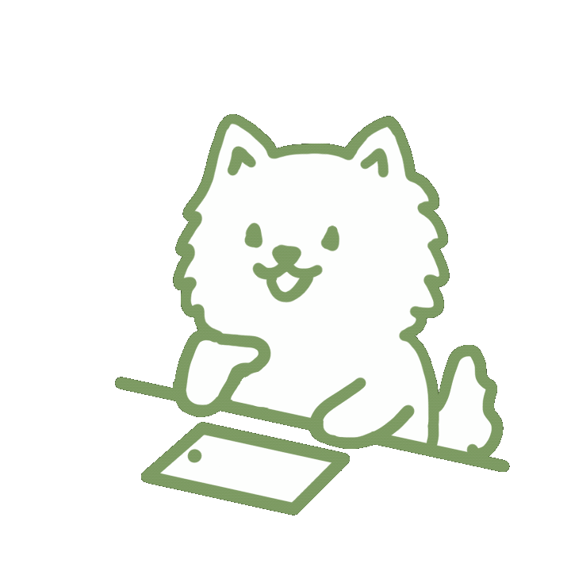
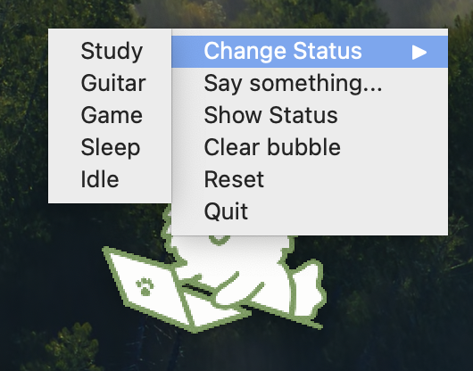
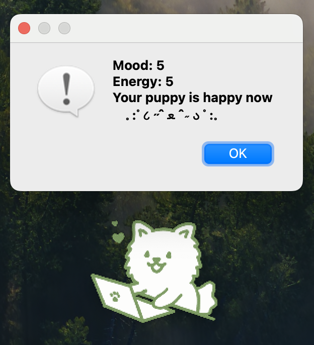

# Desktop Puppy


## Overview
Desktop Puppy is an interactive desktop companion designed to show your own status virtually. It is a puppy based on Samoyed and likes to sleep very much. It can change states automatically based on time, respond to user interactions, and display animations corresponding to its mood and energy. The pet can be manually controlled via a right-click menu and responds to actions such as dragging and double-clicking.




## Features

### 1. Automatic State Switching Based on Computer Time  
The puppy automatically changes its state based on the current time:  

- **23:00-12:00** → Sleep  
- **12:00-19:00** → Study  
- **19:00-20:00** → Guitar  
- **20:00-23:00** → Game  
- **Other times** → Idle  

<figure>
      
     <figcaption>GIF for idle state</figcaption>
</figure> 

### 2. Right-Click Context Menu Features  
The right-click menu provides several options for manual control:  

- **State Switching:** Allows switching between study, guitar, game, sleep, and idle.  
- **Speech Bubble:** Allows adding or modifying a speech bubble (up to 10 characters).  
- **Show Status:** Displays mood, energy, and the current state message.  
- **Clear Bubble:** Removes the speech bubble from the puppy.  
- **Reset Function:** Resets mood and energy once per day.  
- **Quit:** Closes the application.  
- 


### 3. Mood and Energy System  
The puppy has mood and energy values ranging from **0 to 5**.  

- Mood and energy automatically adjust when entering a state.  
- If mood or energy is too low (below **2**), the state switch is prevented, and a warning is displayed.  
- If **mood reaches 1**, the puppy is forced into idle mode.  
- If **energy reaches 1**, the puppy is forced into sleep mode.  




### 4. Click Interaction System  
The puppy responds to mouse actions for interactive engagement:  

- **Left-click dragging:** Moves the desktop puppy around the screen.  
- **Double-click (simulated petting):** Accumulates clicks.  
- **When a random threshold is reached,** the puppy's mood increases by **1** (up to a maximum of 5).  
- **Heart animation is triggered** when petting successfully increases mood.  
- **A 1-minute cooldown applies** after a successful petting action.  


### 5. Speech Bubble Feature  
Users can interact with the puppy through short speech bubbles:  

- The right-click menu allows users to enter and display custom text (up to **10 characters**).  
- The speech bubble appears below the puppy.  
- Users can remove the speech bubble via the right-click menu.  


## Installation  
Ensure you have **PyQt5** installed:  

```bash
pip install PyQt5
```

Then, run the Python script:

```bash
python desktop_puppy.py
```


## Usage  
- Let the puppy automatically change states based on time.  
- Right-click to access the menu for manual adjustments and interactions.  
- Drag the puppy around the screen using the left mouse button.  
- Double-click to pet the puppy, increasing its mood when triggered.  
- Watch its animations change as its mood and energy fluctuate.  


## License  
This project can only be used for academic ways. All the dynamic images were painted by myself and any form of reposting or re-editing is not allowed. Thank you.
